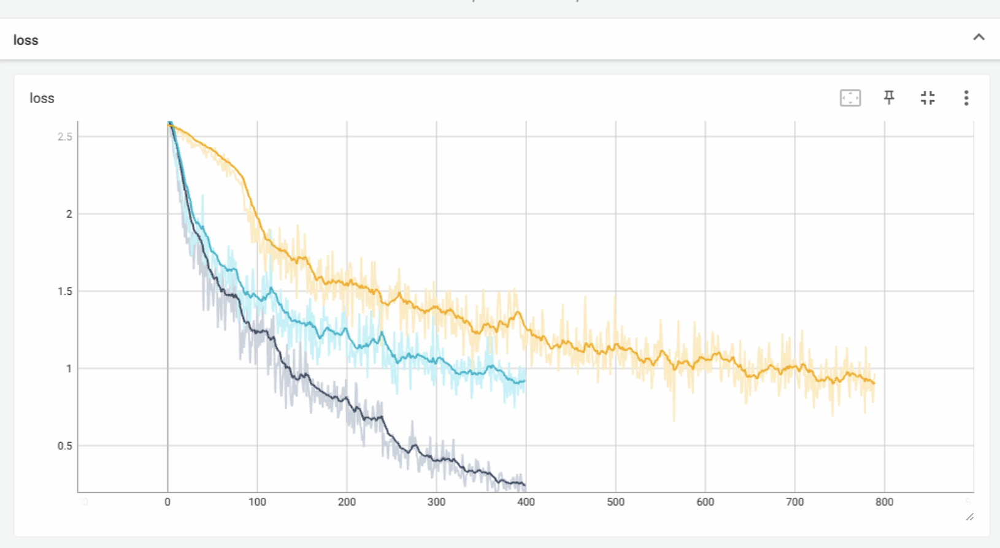
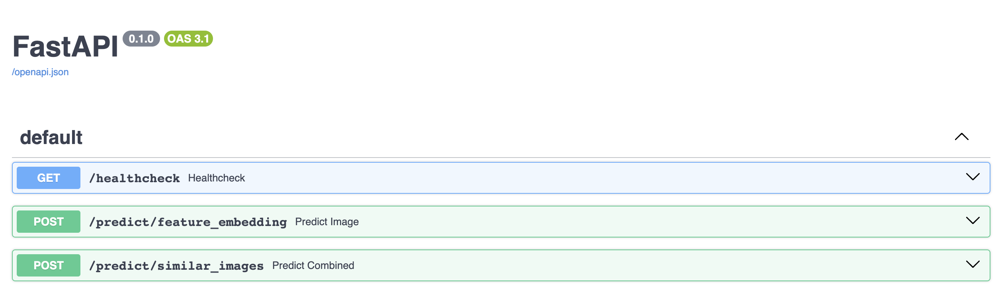
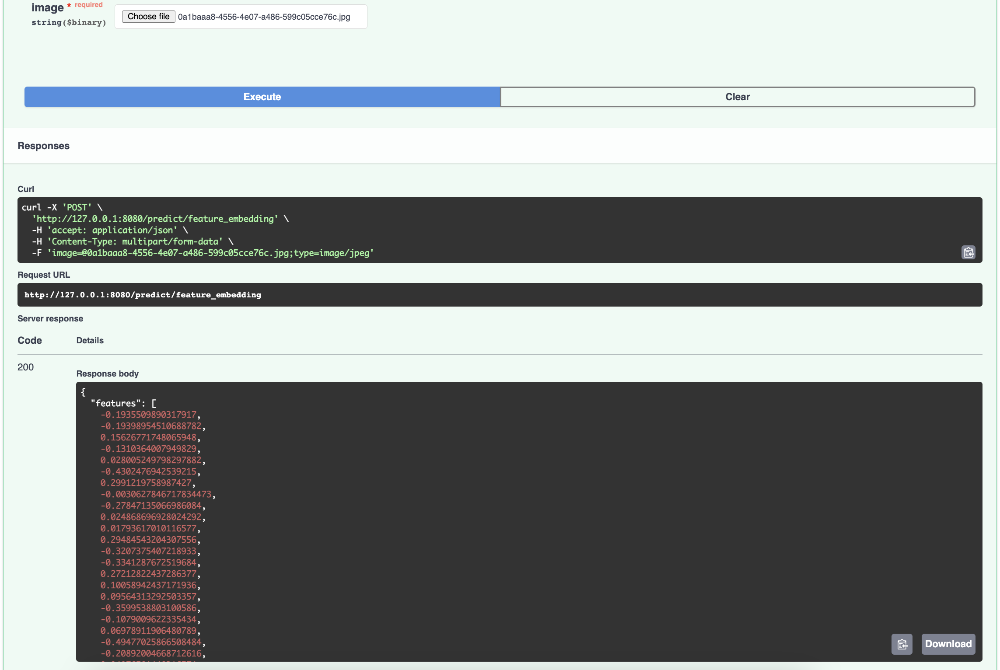
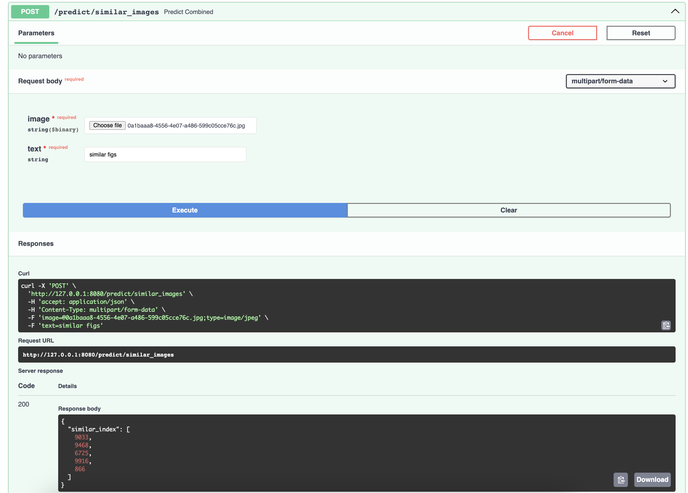

# Facebook Marketplace Recommendation Ranking System
Facebook Marketplace is a platform for buying and selling products on Facebook.

This is an implementation of the system behind the marketplace, which uses AI to recommend the most relevant listings based on a personalised search query.

## Load and clean tabular and image dataset
The labels of image are stored in the tubular sheet. Thus, to clean and find the relevance of datasets is crucial for classification model.

### For tabular datasets: 
Create 'clean_tabular_data.py' to clean 'Product.csv' and 'images.csv'. The program includes three blocks
- Load the files from AWS EC2
- Check null values and extract categories of all products, classify each catagory with list of customed index, build the encoder and decoder
- Merge products and images files where the ids are matched, save them into 'traning_data.csv'

### For image dataset:
Create 'clean_images.py' to standardize the images on their sizes, channels for being consistent. The program contains the following functions:
- Load the images using 'with Image.open' 
- Resize the image with same size of 512 pixels
- Convert all imgages to RGB format, viz, channels=3
- Save images into the new folder

## Create a vision model and turn it into a feature extraction model
Train a CNN model to classify products from the images and use the trained model for feature extraction:
- Load a pretrained Resnet50 model (https://pytorch.org/vision/main/models/generated/torchvision.models.resnet50.html)
- Revise the 'fc' layer to match the classification categories of our task, viz, adding two more layers 'nn.ReLU()' and 'nn.Linear(num_features, num_categories)'
- Avoid overfitting, low layers are frozen, thus, 'layer4' and 'fc' are fine tuned with different learning rates to accelerate learning process. Meanwhile, using 'scheduler' to modify the learning rates per certain epochs will be beneficial to the converging process
- Turn the model into feature extraction model with 1000 features by removing the added classification layers, and use the extraction model to extract vectors of every image
- Discussion of learning rate, batch size and validation rate: here attached the loss function convergence figure which displays the loss function convergence versus different initial conditions. The batch size here plays a critical role for converging speed. Due to the limitation of memory size, the batch size of 128 is the best we can approach on local machine (black line). The validation rate of 68.49% (black line) is relatively good in this case, compared to yellow one (54.32%) with batch size of 32 and blue one (56.54%) of 64. The overfitting happens in the yellow line when the loop goes beyond 400, the validation rate starts to decrease slowly. The learning rate window up to 10% is tested, it seems no huge change will happen. The batch size dominates the convergence slope but due to the hardware limitation there should be a better value. 

## Create the model using FAISS
Build a FAISS search index using image embeddings of the dataset to perform vector similarity search:
- Use feature extraction model to generate a dictionary including the key as the image name with the value of feature vectors and save in a json file
- Build search method and setup parameters in FAISS, and query the similar images

## Configure and deploy the model serving API
Deploy the model serving API to a cloud provider so that it can be accessed by the client:
- Create api.py file that contains the shell for a FastAPI application with two endpoints, one for each model (image feature extraction, FAISS). Such file will handle the post request (image input) and then return the predictions/search result indexes.
- In the same API folder, generate requirement.txt file and dockerfile for docker image, and also include all necessary datasets in the same folder. Then run the command: docker build -t zhiweifan/faiss:x86-version; docker push zhiweifan/faiss:x86-version. Now, the image should be available for any AMD-CPU computer to download and deploy. (For Mac with M series chip, the EC2 should be created with ARM architecture!)
- Login AWS EC2 and pull the image and run the container, then one should be able to access http://<EC2 IPv4 Public IP>:<Port>/docs
- In the FastAPI page to test the application: here attached screenshots to present how they work in the api interface. In the main menu, there are functions named 'feature_embeddings' and 'similar_images'. The target image can be uploaded and excuted with the button on the page. The results --feature vectors and figure indices, can be captured from the output window.

## Packages 
Here attached the packages:
Python == 3.10.12
Pillow == 9.1.1
fastapi == 0.78.0
pydantic == 1.9.1
numpy == 1.25.2
uvicorn == 0.17.6
boto3 == 1.24.9
faiss-cpu == 1.7.4
torchvision == 0.15.2
torch == 2.0.1
transformers
python-multipart

 